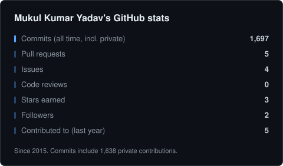
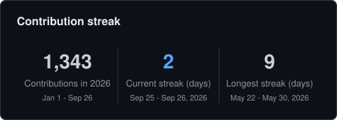
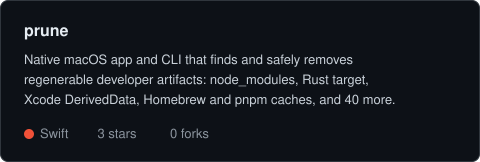

# Mukul Kumar Yadav

Senior software engineer. Ten-plus years building and running production systems
end to end: cloud infrastructure, backend services, data pipelines, and native apps.
I like small tools that remove a problem you had stopped noticing.

## What I work on

- Core AI and deep-tech products: real-time voice agents on self-hosted inference
  (LLM serving, speech-to-text, text-to-speech, telephony), retrieval and analytics
  over large public datasets, and drug-discovery research tooling.
- Payments and fintech infrastructure: self-hosted fiat and multi-chain crypto
  on-ramp/off-ramp, payment orchestration, and ledgering.
- Commerce platforms: headless storefronts, B2B marketplaces, pricing and analytics
  engines over multi-million-row export datasets, and the ETL behind them.
- Native mobile and desktop: Swift/SwiftUI on macOS and iOS, Kotlin on Android.
- Infrastructure and operations: AWS and GCP, Docker, Kubernetes, self-hosted PaaS,
  CI/CD, observability, cost control.
- Security: penetration testing background, GDPR audits, hardening of the systems above.

## Tools I build

Small, single-purpose utilities for problems developers live with by habit. Each one is
open source, read-only unless you tell it otherwise, and ships as a native macOS app
plus a command-line tool where that makes sense.

- [Prune](https://github.com/mk24x7/prune): finds and safely removes regenerable
  developer artifacts and caches: node_modules, Rust target, Xcode DerivedData, Homebrew,
  pnpm, Go and 40 more. Trash by default.
- [Stale](https://github.com/mk24x7/stale): finds the git work on your Mac that exists
  nowhere else: uncommitted changes, unpushed commits, branches with no upstream, stashes,
  repos with no remote.
- [Shadow](https://github.com/mk24x7/shadow): shows which node, python, ruby, java and go
  actually run in each shell, every shadowed copy, and the rc-file line that made the
  winner win.
- [Histclean](https://github.com/mk24x7/histclean): finds API keys, tokens and passwords
  sitting in your shell history and redacts them in place. Offline, never touches the
  network.
- [Wake](https://github.com/mk24x7/wake): explains what woke your Mac, what is blocking
  sleep right now, which settings drain the battery, and battery health, in plain English.
- [truestats](https://github.com/mk24x7/truestats): a GitHub Action that renders profile
  stat cards from the GraphQL API with your own token, so private contributions count and
  nothing depends on a third-party server. The cards below come from it.
- [janitor](https://github.com/mk24x7/janitor): audits every repository you own for
  missing descriptions, licenses and topics, stale forks and archive candidates, and fixes
  the safe ones. Dry run first, always.

## Open source

Recent upstream work includes CI improvements in kubernetes/minikube and a
diagram-rendering fix in mermaid-js/mermaid.

## Tech stack

**Languages**

**Apps and web**

**AI and data**

**Cloud and operations**

## Stats

  
  

  
  

Generated daily by <a href="https://github.com/mk24x7/truestats">truestats</a>.

## Before engineering

I taught astronomy and space science, led a sales team, and ran my own digital
marketing and development agency. That mix is why I care about tools people can
actually adopt, not only tools that are technically right.

## Elsewhere

[hello@mk24x7.com](mailto:hello@mk24x7.com)  |  [mk24x7.com](https://mk24x7.com)  |  [LinkedIn](https://www.linkedin.com/in/mk24x7/)
